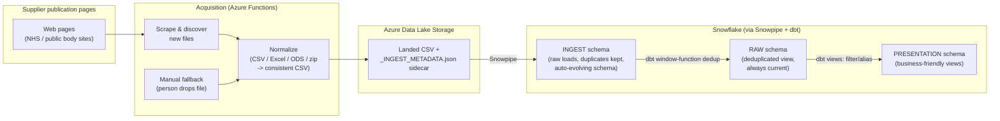
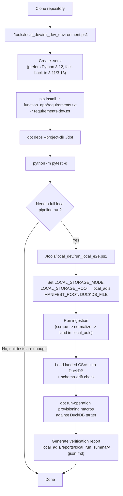
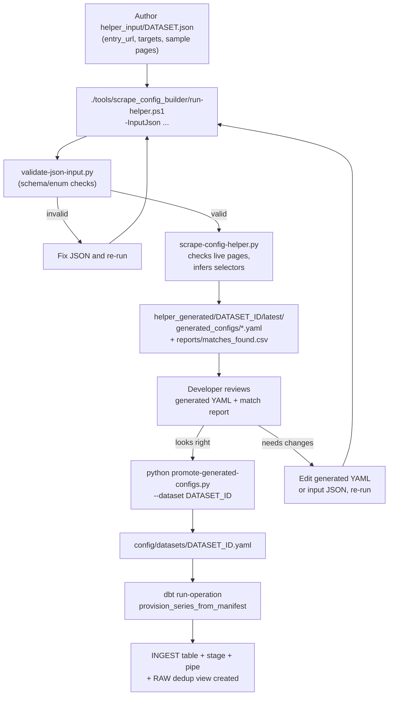
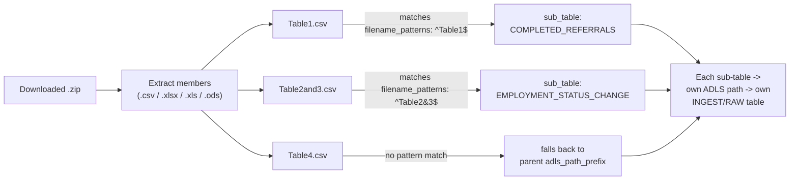
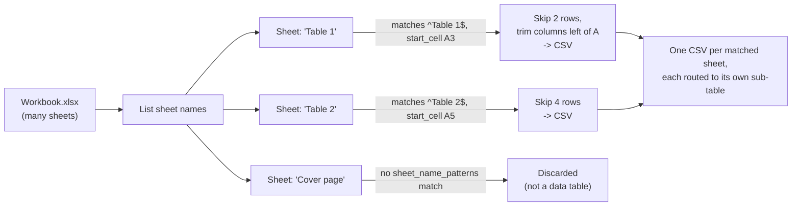
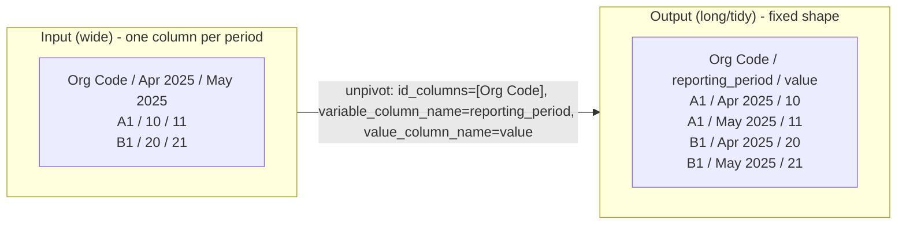

# One London Published Statistics Data Service

This service automatically finds, downloads, and standardises statistics that NHS and other
public bodies publish on their websites (waiting lists, infection rates, mental health
activity, and similar series), then makes that data queryable and trustworthy in Snowflake.

It's written for two audiences:

- **If you're a business or data user**, the [What this service does](#what-this-service-does)
  and [How the data flows](#how-the-data-flows) sections explain the pipeline without needing
  to read code.
- **If you're contributing code**, the [Developer Guide](#developer-guide) section onward
  covers environment setup, dataset onboarding, and the supported data transforms.

## ℹ️ What this service does

Public bodies publish statistics as spreadsheets and CSVs on their own websites, on no fixed
schema and no fixed schedule. This service is a "manifest-driven" robot that:

1. **Watches** supplier publication pages for new files (a "manifest" is a YAML file that
   tells the robot which page to watch, what file to download, and how to read it).
2. **Downloads and normalises** whatever it finds — CSV, Excel, ODS, or zipped bundles of any
   of those — into a consistent CSV shape.
3. **Lands** that CSV in cloud storage (Azure Data Lake Storage) with a record of exactly
   where it came from and when.
4. **Loads** it into Snowflake, removes duplicate re-publications, and exposes a clean,
   business-friendly view for reporting and analysis.

If a source page changes in a way the robot can't handle automatically, the pipeline can fall
back to a manual drop-off location so a person can supply the file instead, without breaking
downstream reporting.

## ℹ️ How the data flows



Each landed file carries a metadata sidecar (`_INGEST_METADATA.json`) recording where it came
from, a content hash used for deduplication, and the inferred subject period — this is the
versioned "contract" between the ingestion robot and the Snowflake/dbt loader described in
[Architecture Notes](#architecture-notes).

## 🏗️ Project Structure

- `config/`: Dataset and supplier configuration manifests.
- `function_app/`: Azure Functions ingestion runtime.
- `dbt/`: dbt project and macros for aliasing, revision views, and provisioning.
- `tests/`: Unit and integration tests (including web-backed tests).
- `tools/`: Local developer and test runner scripts.

See folder-level README files for details.

---

# 🔧 Developer Guide

## ⏬ Prerequisites

- Python 3.11+
- PowerShell 7+ (recommended on Windows)
- Internet access for web-backed integration tests

## 🖥️ Setting up a developer environment



Quick start commands:

```powershell
./tools/local_dev/init_dev_environment.ps1
python -m pytest -q
```

Run the full suite including web-backed tests:

```powershell
$env:RUN_WEB_E2E = 'true'
python -m pytest -q
Remove-Item Env:RUN_WEB_E2E -ErrorAction SilentlyContinue
```

## 🧪 Local End-to-End Run

```powershell
./tools/local_dev/run_local_e2e.ps1
```

This sets local storage emulation and runs pytest with `MANIFEST_ROOT` defaulting to
`config/datasets` for full local simulation.

Use fixture manifests for faster smoke runs:

```powershell
./tools/local_dev/run_local_e2e.ps1 -UseFixtures
```

Use execution mode and local download caps:

```powershell
# full (default), scrape-only, or load-only
./tools/local_dev/run_local_e2e.ps1 -ExecutionMode full -MaxFilesPerTarget 3 -MaxTotalFiles 50
```

By default, local runs now generate verification evidence reports after pytest:

- `.local_adls/reports/local_run_summary.json`
- `.local_adls/reports/local_run_summary.md`

Run the verification utility directly:

```powershell
python tools/local_dev/verify_local_run.py --report-dir ./.local_adls/reports --report-prefix local_run_summary
```

## ⚙️ Ingestion Runtime Configuration

Primary environment variables:
- `MANIFEST_ROOT`: path to manifest files (default `../config/datasets` from function app).
- `LOCAL_STORAGE_MODE`: `true` to use local filesystem instead of Azure Blob.
- `LOCAL_STORAGE_ROOT`: local root path when `LOCAL_STORAGE_MODE=true`.
- `MANUAL_INPUT_PREFIX`: ADLS/manual prefix for fallback files.
- `TELEMETRY_PREFIX`: ADLS prefix for ingestion telemetry JSONL events.
- `INGEST_EXECUTION_MODE`: `full` (default), `scrape-only`, or `load-only`.
- `LOCAL_DATASET_PROFILE_FILE`: optional file path with `INCLUDE_DATASET_IDS=` and
   `EXCLUDE_DATASET_IDS=` entries.
- `INCLUDE_DATASET_IDS` / `EXCLUDE_DATASET_IDS`: optional comma-separated filters.
- `LOCAL_MAX_FILES_PER_TARGET`: optional per-target cap in local mode.
- `LOCAL_MAX_FILES_PER_DATASET`: optional per-dataset cap in local mode.
- `LOCAL_MAX_TOTAL_FILES`: optional global cap in local mode.
- `ADLS_ACCOUNT_URL`, `ADLS_CONTAINER`, `ADLS_PREFIX`: production storage settings.

Sample local settings are provided at `function_app/local.settings.sample.json`.

## ➕ Adding a New Dataset Configuration

Preferred helper workflow:



```powershell
# 1) Validate + generate + report summary
./tools/scrape_config_builder/run-helper.ps1 -InputJson tools/scrape_config_builder/helper_input/<dataset>.json

# 2) Review generated artifacts
# tools/scrape_config_builder/helper_generated/<dataset_id>/latest/

# 3) Promote reviewed YAML into config/datasets
python tools/scrape_config_builder/promote-generated-configs.py --dataset <dataset_id>

# 3b) Promote reviewed YAML into config/datasets (PowerShell wrapper)
./tools/scrape_config_builder/promote-generated-configs.ps1 -Dataset <dataset_id>
```

1. Create a new YAML file in `config/datasets/`.
2. Define required top-level keys:
   - `dataset_id`
   - `series_id`
   - `entry_url`
   - `publication_date` with `source` and `pattern`
   - `targets` (one or more)
   - optional `subject_period` with `source` and `pattern`
3. For each target, define:
   - `sub_dataset_id`
   - `scrape_steps` with `link_selector` and optional `text_filter`, `file_extensions`
   - optional `page_date_selectors` for page-level publication/revision extraction
   - optional `reporting_period_columns`
4. Optionally define `fallback` settings for manual acquisition.
5. Add tests or extend fixture coverage under `tests/`.
6. Run `python -m pytest -q` and, where relevant, web-backed tests.

Example manifests are available under `config/datasets/` and `tests/fixtures/manifests/`.

## ⚙️ Supported Source Transforms

Supplier files rarely arrive in a flat, analysis-ready shape. Three target settings in the
dataset manifest (`config/datasets/<dataset_id>.yaml`) handle the most common cases. All three
are implemented in `function_app/src/download_and_normalize.py` and run during normalisation —
before anything reaches ADLS or Snowflake.

### 🗃️ Zip archives → 📚 multiple sub-tables

A single downloaded zip can bundle several CSV/Excel/ODS files (e.g. one file per report
table). Each `sub_tables` entry matches extracted file names by regex (`filename_patterns`)
and routes that file to its own object/ADLS path; unmatched files fall back to the parent
target.



```yaml
sub_tables:
  - object_name_suffix: TALKING_THERAPY_QTR_TBL01_COMPLETED_REFERRALS
    adls_path_prefix: talking-therapies-statistics/qrt-report-tbl01-completed-referrals
    filename_patterns:
      - ^Table1$
```

### 📅 Excel/ODS tables at an offset, across multiple sheets

Published workbooks often bury the real table a few rows down, and a single workbook may
contain several distinct tables on different tabs. `sheet_name_patterns` (regex) selects
which sheets are real data tables — discarding cover/summary tabs — and `start_cell` (e.g.
`A3`) tells the reader how many header rows to skip and which column the table starts at.
Each matched sheet becomes its own output CSV.



```yaml
sub_tables:
  - object_name_suffix: CHS_WAIT_NON_SUBMISSION
    adls_path_prefix: community-health-services-waiting-list/non-submission-data
    sheet_name_patterns:
      - ^Table 1$
    start_cell: A3
```

### ⤵️ Pivot/unpivot — wide tables to long, tidy tables

Some sources add a new column on every release (one per reporting period, or one per metric),
which would otherwise cause the ingested table's schema to grow indefinitely. `unpivot`
(backed by `pandas.DataFrame.melt`) collapses any number of value columns into a fixed
three-part shape: stable identifier columns, a "what was this column called" column, and a
"what was the value" column.



```yaml
unpivot:
  id_columns:
    - Organisation name
    - Organisation code
    - Metric
  variable_column_name: Period
  value_column_name: Value
```

`unpivot` can be set per-target (whole source) or per-sub-table (one routed sheet/file only),
and combines with `start_cell` and `sheet_name_patterns` when a single workbook needs both
offset-table detection and reshaping.

## ❄️ dbt and Snowflake Provisioning Notes

The dbt project implements a three-layer data pipeline:

### 1️⃣ INGEST Schema
Snowpipe-loaded tables receiving all file uploads directly from ADLS (including re-uploads/duplicates).
- Auto-evolving schema via Snowflake's `enable_schema_evolution=true`
- Full audit trail of ingestions
- Zero maintenance required

### 2️⃣ RAW Schema
Deduplicated views over INGEST tables, always reflecting current data.
- One view per INGEST table
- Deduplication based on file content hash (`_FILE_CONTENT_KEY`) via window function
- Preserves latest version when same file is uploaded multiple times
- Schema auto-inherits from INGEST — new CSV columns flow through immediately
- Can be promoted to a Dynamic Table later if query performance requires it

### 3️⃣ PRESENTATION Schema
Business views on top of RAW tables with filtering and aliasing.

**To provision a new dataset**:

1. Create manifest at `config/datasets/<dataset_id>.yml`
2. Run a single dbt macro to create INGEST table, stage, pipe, and RAW dedup view together:
   ```powershell
   dbt run-operation one_london_psds.provision_series_from_manifest \
     --args 'manifest_path: ../config/datasets/<dataset_id>.yml'
   ```

No per-dataset SQL files are required. The macro applies identical logic to every dataset.

Before using dbt operations, ensure dependencies are installed:

```powershell
dbt deps --project-dir ./dbt
```

Deployment defaults for non-secret Snowflake/dbt artifact settings are stored in
`config/dbt/deployment.settings.json` and consumed by `tools/ci_dbt_deploy.ps1`.

## 📝 Architecture Notes

### Terraform and Snowflake Code Ownership

Recommended ownership split:
- Terraform repository owns cloud and platform infrastructure lifecycle.
- This repository owns ingestion, manifest logic, dbt transformations, and data-plane onboarding logic.

Terraform repository scope (infrastructure plane):
- Azure Function App resource, storage account/container, identity, network, RBAC, secrets wiring.
- Snowflake account-level/platform primitives where managed centrally (for example account integrations and baseline warehouses/roles).

This repository scope (application and data plane):
- Function app ingestion behavior and manifests.
- dbt project, macros, staging/presentation/revision models.
- Dataset onboarding logic including raw table, stage, pipe, and schema-level conventions.

This keeps platform provisioning centralized while allowing dataset onboarding and model evolution to remain close to code and tests.

### Formal Contract Between Function App and dbt Loader

Treat the handoff as a versioned data contract with explicit compatibility rules.

Contract components:
- Path contract:
   - series_id/sub_dataset_id/download_year=YYYY/download_month=MM/downloaded_at=YYYYMMDDTHHMMSS/file.csv
- Sidecar metadata contract (_INGEST_METADATA.json):
   - _SOURCE_FILE_PATH
   - _FILE_CONTENT_KEY
   - _SUBJECT_PERIOD_FROM
   - _SUBJECT_PERIOD_TO
   - _PUBLICATION_DATE
   - _ACQUISITION_METHOD
   - _FALLBACK_REASON
   - _SERIES_ID
   - _SUB_DATASET_ID
- Manifest contract:
   - required keys plus optional subject_period and target.page_date_selectors
- Schema contract:
   - loader treats ingestion metadata columns as reserved (_PUBLICATION_DATE, etc.)

Formalization pattern:
1. Introduce CONTRACT_VERSION in sidecar payload and document version history.
2. Add contract tests that validate path format, mandatory metadata fields, and manifest parsing.
3. Enforce backward compatibility policy for one previous contract version before removing support.
4. Fail CI on contract-breaking changes unless version is incremented and migration notes are included.

Version bump rules for CONTRACT_VERSION:
- Bump MAJOR (X.0.0) for breaking contract changes (for example path shape changes, renamed/removed required sidecar fields, or incompatible manifest key semantics).
- Bump MINOR (x.Y.0) for backward-compatible additions (for example new optional sidecar fields, new optional manifest keys, or additional supported selector behavior).
- Bump PATCH (x.y.Z) for non-contract fixes only (for example bug fixes, documentation clarifications, and implementation changes that preserve all existing contract inputs/outputs).
- Any MAJOR or MINOR bump must include a short migration note in PR description and README change summary.


## CI/CD Pipeline & Secure Deployment

This project supports robust, secure, and environment-agnostic CI/CD for dbt/Snowflake deployments using both GitHub Actions and Azure DevOps. All pipeline logic is implemented in reusable PowerShell scripts under `tools/`.

- **Linting**: Runs pre-commit checks (ruff check + ruff format) on all branches.
- **Testing**: Runs the full pytest suite (unit and integration) on all branches.
- **Deployment**: Runs `dbt run` and `dbt test` against Snowflake on the `main` branch only.

See [docs/CI-CD.md](docs/CI-CD.md) for full details, including:
- Required secrets/variables for both platforms
- How to use key-pair authentication for Snowflake (recommended)
- How credentials are handled securely
- How to test deployment scripts locally

### Quick Reference: Secure Snowflake Auth

- Set `SNOWFLAKE_PRIVATE_KEY` (and optional `SNOWFLAKE_PRIVATE_KEY_PASSPHRASE`) for key-pair auth
- If not set, falls back to `SNOWFLAKE_PASSWORD`
- The script `tools/ci_render_profiles_yml.ps1` generates a secure `profiles.yml` for dbt at runtime

## Quality Gates

Recommended checks before commit:
- `./tools/local_dev/run_lint.ps1`
- `./tools/local_dev/run_lint.ps1 -Fix` (optional auto-fix pass)
- `./tools/linting/run_lint_suite.ps1` (canonical lint suite entrypoint)
- `./tools/local_dev/install_pre_commit.ps1` (one-time hook install)
- `python -m pre_commit run --all-files` (optional manual hook run)
- `python -m pytest -q`
- `RUN_WEB_E2E=true python -m pytest -q tests/test_web_to_duckdb_e2e.py`